<h1>Phixelgator</h1>
Sorry for the dumb title! I couldn't think of anything. This is a command line utility that converts a photo to "pixel art", i.e. a lower resolution version of the same image with a custom color palette.

The idea is that you can specify one of the built-in palettes to use with the `-p` flag, or you can load a custom palette with the `-c` flag. The palette files should be in a valid JSON subset consisting of ONE top-level array containing an arbitrary number of arrays that all have EXACTLY three elements, all integers from 0-255. These are representative of RGB values. You can set the pixel width/height of the monochrome blocks to be generated with the `-b` option. Default is to create 8x8 blocks.

Aside from some basic, tangential image manipulation features like auto-cropping and resizing, the main extra feature is the ability to generate custom color palette files with an input image. Run phixelgator with the `-g` flag to convert the input image into a color palette file that can then be used with the `-c` flag. It's not recommended that you use palette files created with very complex images, as extremely large color palettes are the biggest bottleneck in performance. If you just want all the original colors of the image available with a more pixelized look, you can just run it without the `-p` or `-c` flag.

<h2>Installation</h2>
I've tested this successfully on Ubuntu Linux, OSX, and Windows. Dependencies are python &gt;= 2.7 and the python imaging library "PIL". It should work with older versions of python as well, but you'll have to install the argparse library separately. This should be enough on mac and linux:

<pre>
sudo easy_install PIL 
sudo easy_install argparse
</pre>

On Windows, you can just get the installers from the site or whatever people do on Windows :P

Once that stuff is done, checkout the repo, and make sure it's executable:

<pre>
git clone https://github.com/nathanharper/phixelgator.git
cd phixelgator
chmod +x phixelgator.py
./phixelgator.py -h
</pre>

That's it! The last line in there should print the help info, which should be very up-to-date. You can also check out the bash scripts in the "tests" directory if you want to see some examples.

<h2>Examples</h2>
Here's a before and after of my cat using the Atari 2600 color palette.

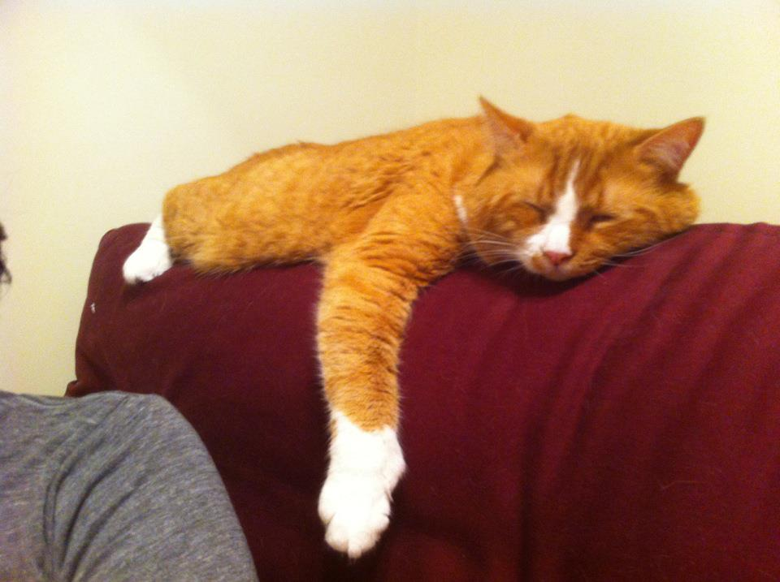

Then you do a little... `phixelgator.py -p atari2600 ernie.jpg atari2600.png`

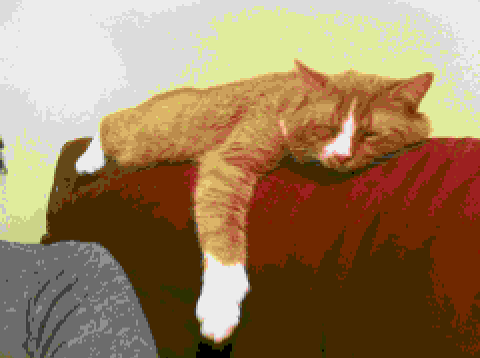

And voila!

Here are the other default palettes.

<h3>Apple II</h3>
`phixelgator.py -p appleii ernie.jpg appleii.png`
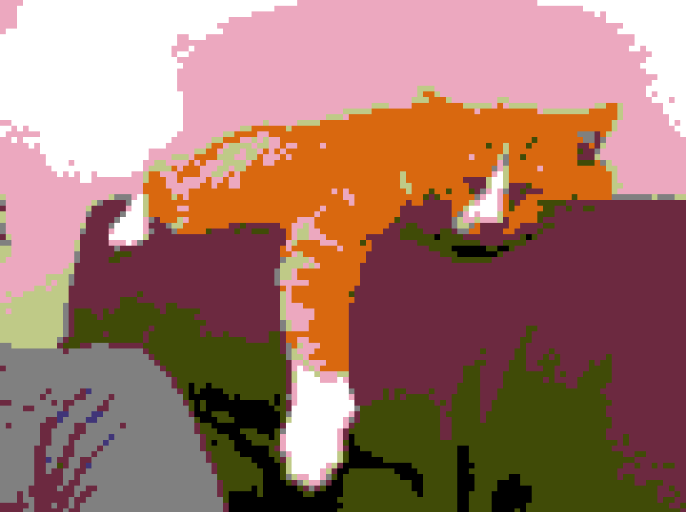

<h3>Commodore 64</h3>
`phixelgator.py -p commodore64 ernie.jpg commodore64.png`
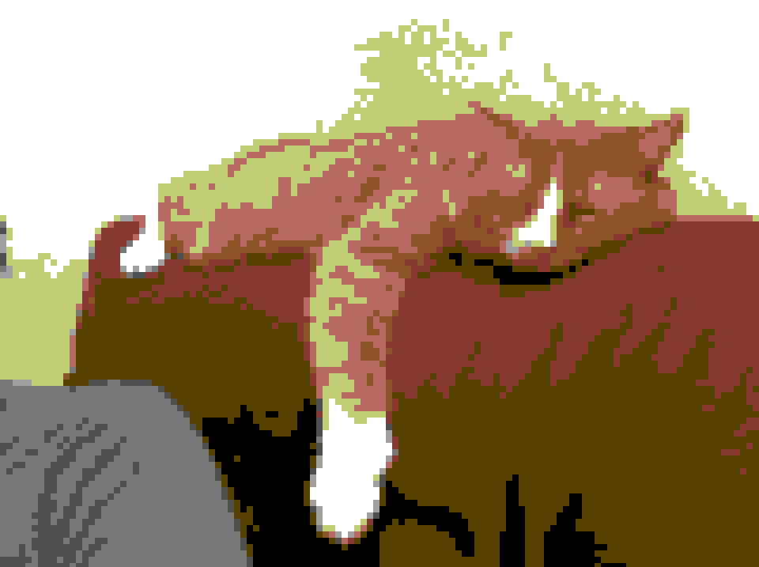

<h3>Contra</h3>
`phixelgator.py -p contra ernie.jpg contra.png`
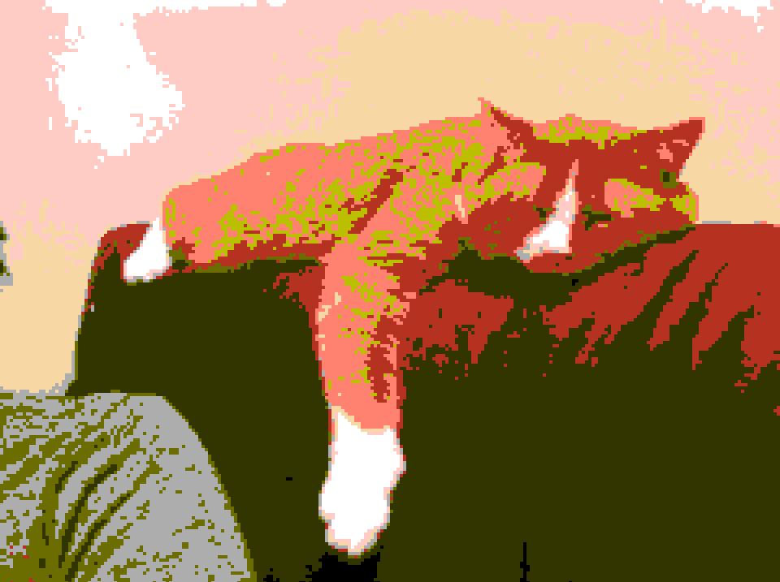

<h3>Gameboy</h3>
`phixelgator.py -p gameboy ernie.jpg gameboy.png`
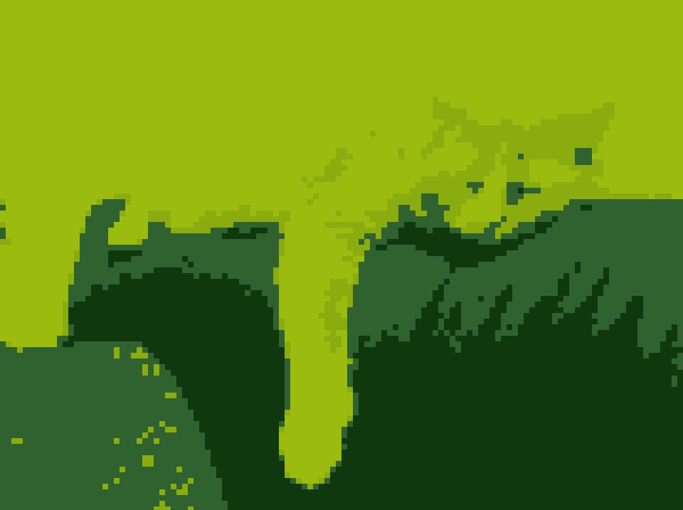

<h3>Grayscale</h3>
`phixelgator.py -p grayscale ernie.jpg grayscale.png`
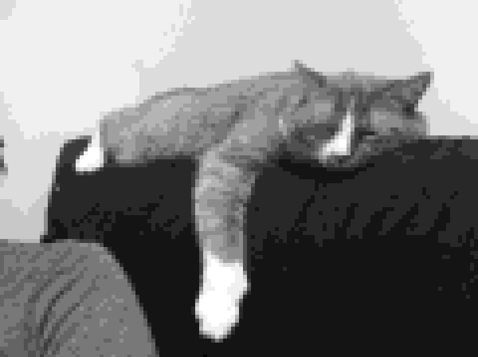

<h3>Hyrule</h3>
`phixelgator.py -p hyrule ernie.jpg hyrule.png`
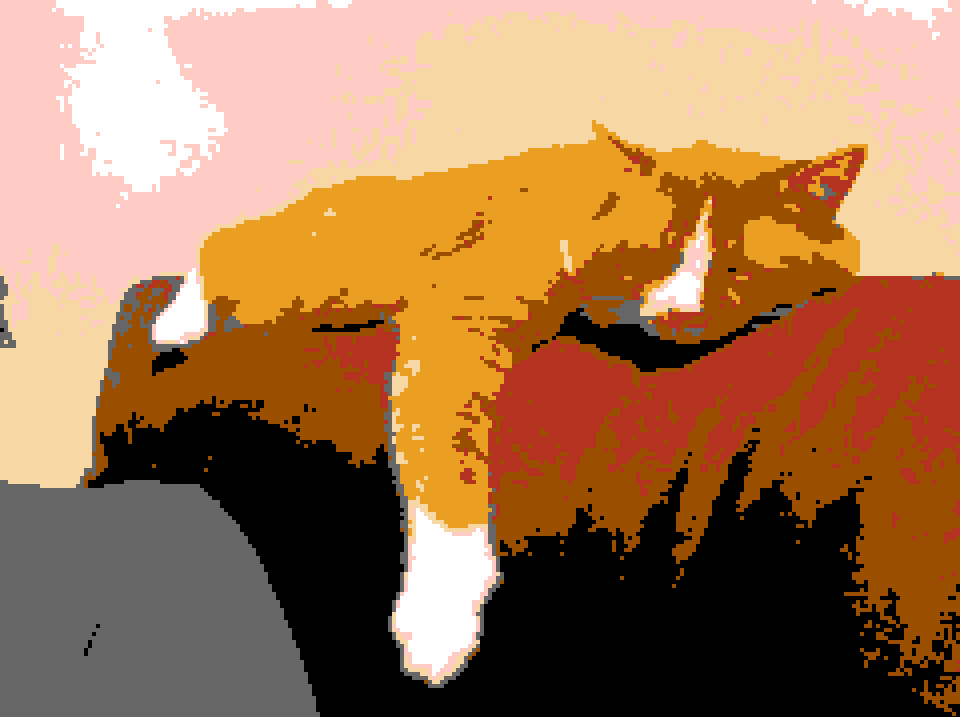

<h3>Intellivision</h3>
`phixelgator.py -p intellivision ernie.jpg intellivision.png`
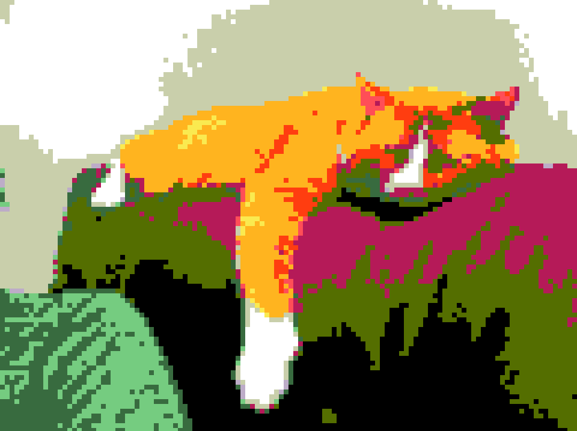

<h3>Kungfu</h3>
`phixelgator.py -p kungfu ernie.jpg kungfu.png`
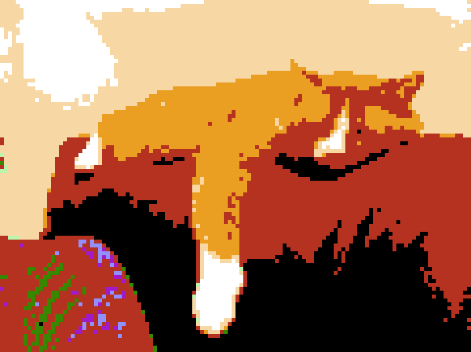

<h3>Super Mario Bros.</h3>
`phixelgator.py -p mario ernie.jpg mario.png`
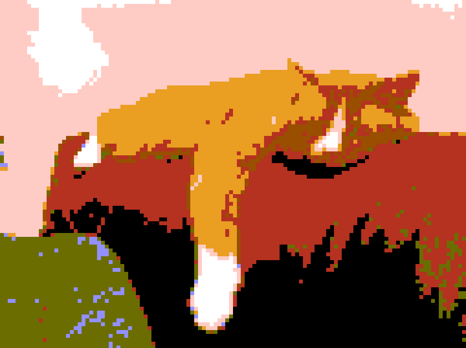

<h3>NES</h3>
`phixelgator.py -p nes ernie.jpg nes.png`

<h3>Sega</h3>
`phixelgator.py -p sega ernie.jpg sega.png`
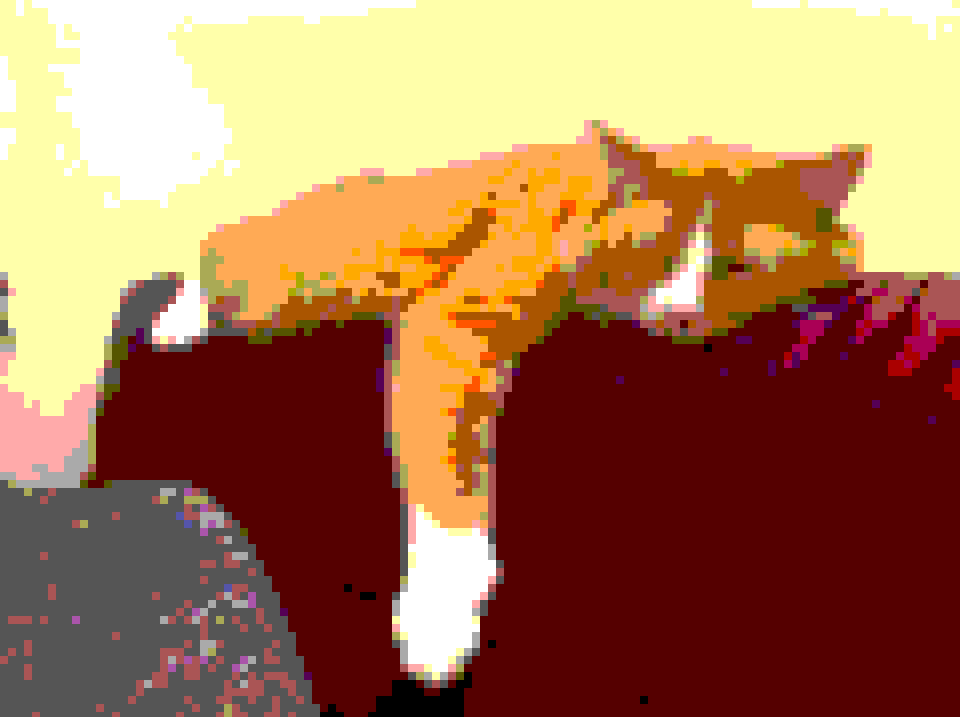

<h3>Tetris</h3>
`phixelgator.py -p tetris ernie.jpg tetris.png`
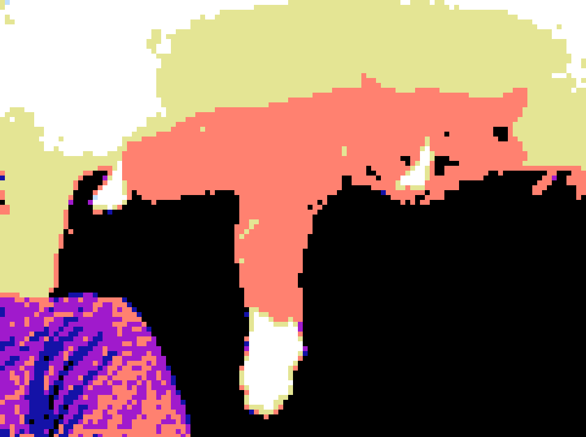

<h2>Acknowledgement</h2>
This tool is *heavily* inspired by this site: http://superpixeltime.com/
 
One might even say that I just ported it to Python! So, many thanks to the creators. They are:
 
<a href="http://www.johnnylml.com/">John Lee</a> and <a href="http://famousaspect.com/">Ethan Levy</a>
